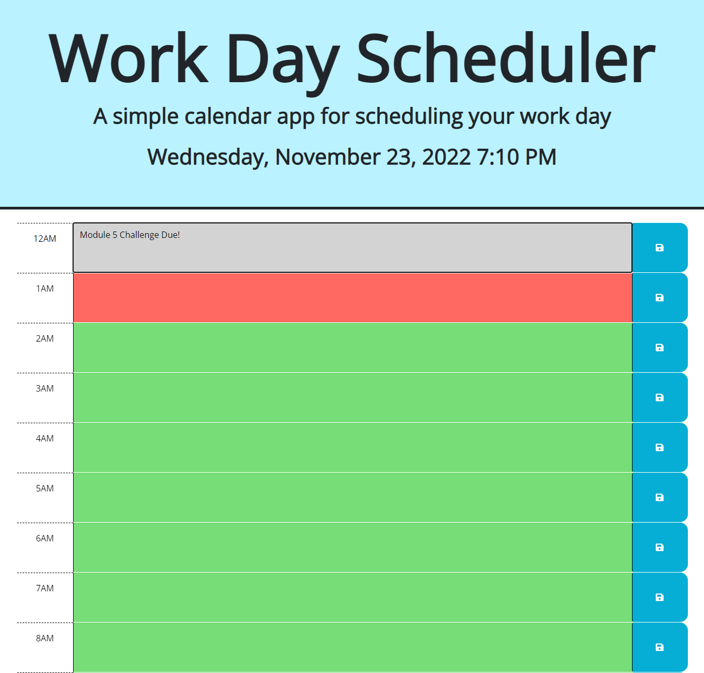

#  <CxLos5-Planner>

## Description

Provide a short description explaining the what, why, and how of your project. Use the following questions as a guide:

- I built this project to help me organize my days better and be a little more concious about time-management. This assignment is made to solve the issue of forgetfulness and people not writing down everything they need to get done for the day. This is extrememly useful for forgetful people. Making this project, I learned how to to work with time using dayjs, and how to save entries in the local storage.

## Usage

This Planner is super simple to use. the previous hours are grayed out, current hour is red, and future time slots are green. Simply just jot down the things you have planned for the day and save the entry!

https://cxlos.github.io/CxLos5-Planner/

## License

MIT License

Copyright (c) 2022 CxLos

Permission is hereby granted, free of charge, to any person obtaining a copy
of this software and associated documentation files (the "Software"), to deal
in the Software without restriction, including without limitation the rights
to use, copy, modify, merge, publish, distribute, sublicense, and/or sell
copies of the Software, and to permit persons to whom the Software is
furnished to do so, subject to the following conditions:

The above copyright notice and this permission notice shall be included in all
copies or substantial portions of the Software.

THE SOFTWARE IS PROVIDED "AS IS", WITHOUT WARRANTY OF ANY KIND, EXPRESS OR
IMPLIED, INCLUDING BUT NOT LIMITED TO THE WARRANTIES OF MERCHANTABILITY,
FITNESS FOR A PARTICULAR PURPOSE AND NONINFRINGEMENT. IN NO EVENT SHALL THE
AUTHORS OR COPYRIGHT HOLDERS BE LIABLE FOR ANY CLAIM, DAMAGES OR OTHER
LIABILITY, WHETHER IN AN ACTION OF CONTRACT, TORT OR OTHERWISE, ARISING FROM,
OUT OF OR IN CONNECTION WITH THE SOFTWARE OR THE USE OR OTHER DEALINGS IN THE
SOFTWARE.
